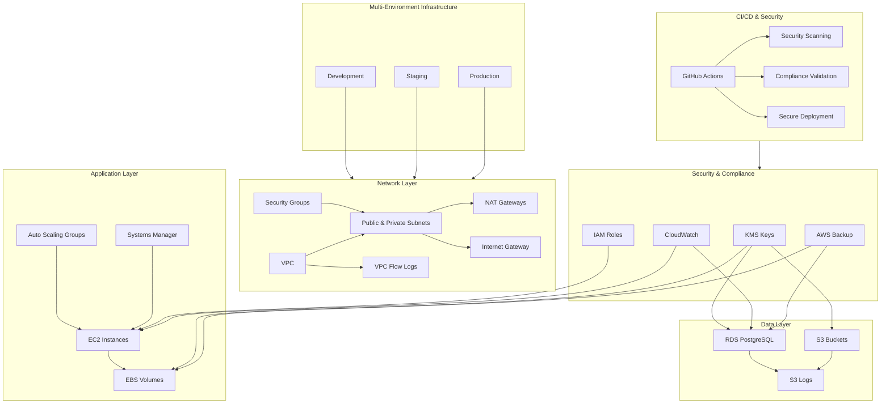

# AWS Infrastructure with Terragrunt

Infrastructure deployment using Terragrunt for multi-environment AWS resources. Implements SOC2 and PCI-DSS compliance controls required for financial services workloads with comprehensive security validation and automated CI/CD pipelines.

## Features

- Multi-environment configurations (dev, staging, production)
- SOC2 and PCI-DSS compliance controls
- Environment-specific resource sizing to control costs
- Multi-AZ deployments for production reliability
- Cross-region backup replication
- Infrastructure validation test suite
- Automated security scanning and compliance validation
- GitHub Actions CI/CD pipelines with security controls
- Comprehensive monitoring and alerting

## Security Features

### Automated Security Validation
- **Pre-deployment security scanning** with tfsec and checkov
- **Compliance validation** against SOC2 and PCI-DSS standards
- **Vulnerability scanning** with trivy
- **Cost estimation** and budget compliance monitoring
- **Configuration validation** for security best practices

### GitHub Actions Workflows
- **security-scan.yml**: Automated security scanning on pull requests
- **validate.yml**: Infrastructure validation and testing
- **deploy.yml**: Secure deployment with environment protection
- **compliance.yml**: Compliance validation and reporting
- **security-config.yml**: Security configuration and policies

### Compliance Frameworks
- **SOC2 Type II**: Complete control environment compliance
- **PCI-DSS Level 1**: Payment card industry security standards
- **Automated compliance reporting** and validation

## Resource Map



## Environment Configuration

| Component | Development | Staging | Production |
|-----------|------------|----------|------------|
| **Network** |
| VPC CIDR | 10.0.0.0/16 | 172.16.0.0/16 | 192.168.0.0/16 |
| Availability Zones | 2 | 2 | 3 |
| NAT Gateways | 1 | 2 | 3 |
| VPC Flow Logs | Basic | Enhanced | Full |
| **Compute** |
| EC2 Instance Type | t3.micro | t3.medium | t3.large |
| Auto Scaling Min | 1 | 2 | 3 |
| Auto Scaling Max | 3 | 6 | 10 |
| EBS Volume Type | gp3 | gp3 | io2 |
| **Database** |
| RDS Instance Class | db.t3.small | db.t3.large | db.r6g.xlarge |
| Multi-AZ | No | Yes | Yes |
| Backup Retention | 7 days | 14 days | 35 days |
| Performance Insights | 7 days | 14 days | 731 days |
| **Storage** |
| S3 Versioning | Enabled | Enabled | Enabled |
| S3 Encryption | SSE-S3 | SSE-KMS | SSE-KMS |
| **Security** |
| Security Scanning | Basic | Enhanced | Full |
| Compliance Validation | SOC2 | SOC2 + PCI-DSS | SOC2 + PCI-DSS |
| Monitoring | Basic | Enhanced | Comprehensive |

## Directory Structure

```
terraform-katherine/
├── _envcommon/
│   └── common.hcl              # Common environment configuration
├── .github/
│   └── workflows/              # GitHub Actions CI/CD pipelines
│       ├── security-scan.yml   # Security scanning workflow
│       ├── validate.yml        # Infrastructure validation
│       ├── deploy.yml          # Secure deployment
│       ├── compliance.yml      # Compliance validation
│       ├── security-config.yml # Security configuration
│       ├── terraform.yml       # Basic Terraform workflow
│       └── README.md           # Workflow documentation
├── modules/
│   └── ec2/                    # EC2 module
│       ├── main.tf
│       ├── variables.tf
│       ├── outputs.tf
│       └── versions.tf
├── dev/
│   └── eu-west-2/              # Development environment
│       ├── env.hcl
│       ├── terragrunt.hcl
│       ├── network/            # VPC, subnets, routing
│       ├── security/           # Security groups, IAM
│       ├── storage/            # S3 buckets
│       ├── database/           # RDS instances
│       └── compute/            # EC2 instances
├── staging/
│   └── eu-west-2/              # Staging environment
│       ├── env.hcl
│       ├── terragrunt.hcl
│       ├── network/
│       ├── security/
│       ├── storage/
│       ├── database/
│       └── compute/
├── prod/
│   └── eu-west-2/              # Production environment
│       ├── env.hcl
│       ├── terragrunt.hcl
│       ├── network/
│       ├── security/
│       ├── storage/
│       ├── database/
│       └── compute/
├── test/
│   └── infrastructure_test.go  # Infrastructure tests
├── account.hcl                 # Account-level configuration
├── region.hcl                  # Region-level configuration
├── env.hcl                     # Environment-level configuration
├── terragrunt.hcl              # Root Terragrunt configuration
├── SECURITY_CONFIG.md          # Security configuration guide
└── README.md                   # This file
```

## Quick Start

### Prerequisites
- Terraform >= 1.0
- Terragrunt >= 0.35
- AWS CLI configured
- GitHub repository with Actions enabled

### Initial Setup
1. Configure AWS credentials:
   ```bash
   aws configure
   ```

2. Update configuration files:
   - `account.hcl`: AWS account details
   - `region.hcl`: AWS region settings
   - `env.hcl`: Environment-specific settings

3. Deploy infrastructure:
   ```bash
   # Development
   cd dev/eu-west-2/network && terragrunt apply
   cd ../security && terragrunt apply
   cd ../storage && terragrunt apply
   cd ../database && terragrunt apply
   cd ../compute && terragrunt apply

   # Staging
   cd ../../staging/eu-west-2/network && terragrunt apply
   # ... continue with other components

   # Production
   cd ../../prod/eu-west-2/network && terragrunt apply
   # ... continue with other components
   ```

## Security Validation

### Automated Security Scanning
The project includes comprehensive security validation through GitHub Actions:

- **Security Scanning**: Runs on every pull request
- **Compliance Validation**: Ensures SOC2 and PCI-DSS compliance
- **Infrastructure Validation**: Validates Terraform configurations
- **Cost Estimation**: Monitors infrastructure costs

### Manual Security Validation
```bash
# Run security scans locally
tfsec .
checkov -f .
trivy fs .

# Run infrastructure tests
go test ./test/
```

## Monitoring and Alerting

### CloudWatch Dashboards
- Infrastructure overview dashboard
- Security and compliance dashboard
- Cost and usage dashboard

### Alarms
- High CPU/memory utilization
- Database connection limits
- Security events
- Compliance violations
- Cost budget alerts

## Compliance

### SOC2 Type II Controls
- **CC1**: Control Environment
- **CC2**: Communication and Information
- **CC3**: Risk Assessment
- **CC4**: Monitoring Activities
- **CC5**: Control Activities

### PCI-DSS Level 1 Requirements
- **Requirement 1**: Firewall configuration
- **Requirement 2**: Secure configuration
- **Requirement 3**: Data encryption
- **Requirement 4**: Transmission encryption
- **Requirement 5**: Antivirus software
- **Requirement 6**: Security patches
- **Requirement 7**: Access control
- **Requirement 8**: User identification
- **Requirement 9**: Physical access
- **Requirement 10**: Audit logging
- **Requirement 11**: Vulnerability scanning
- **Requirement 12**: Security policy

## Contributing

1. Follow the established naming conventions
2. Ensure all resources are properly tagged
3. Include comprehensive documentation
4. Test changes in development environment first
5. Follow security best practices
6. Run security validation before submitting changes
7. Ensure compliance with security frameworks

## Support

### Documentation
- [Security Configuration Guide](SECURITY_CONFIG.md)
- [GitHub Actions Documentation](.github/workflows/README.md)
- [Terragrunt Documentation](https://terragrunt.gruntwork.io/docs/)

### Contacts
- **Infrastructure Team**: infrastructure@company.com
- **Security Team**: security@company.com

## License

This infrastructure code is proprietary and confidential.

---

**Built with security-first approach using Terragrunt and AWS**

*Last updated: $(date +'%Y-%m-%d')*